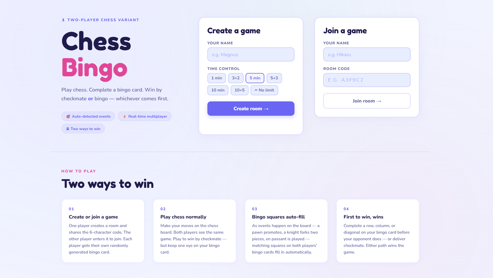

# Chess Bingo 🎯♟️

A two-player game where you play chess and race to complete a bingo card at the same time. Win by **checkmate** — or be the first to complete a row, column, or diagonal on your bingo board.

Live at: **[chess-bingo.onrender.com](https://chess-bingo.onrender.com)**

---

## Screenshots



---

## How to play

1. One player creates a room and chooses a time control
2. Share the 6-character room code (or use the copy link / email invite buttons)
3. The other player enters the code to join
4. Play chess — bingo squares fill in **automatically** as events happen on the board (en passant, knight fork, pawn promotion, etc.)
5. First player to get checkmate **or** complete a bingo line wins
6. After the game, analyse on Lichess or request a rematch (colors swap automatically)

---

## Features

- **Real-time multiplayer** via Socket.io
- **Auto-detected bingo events** — 24 events drawn from chess.js move data, no manual marking
- **Time controls** — 1 min, 3+2, 5 min, 5+3, 10 min, 10+5, or unlimited
- **Move history** with back/forward navigation
- **Rematch** with color swap — accept/decline flow
- **Lichess analysis** — export PGN with player names directly to Lichess
- **Shareable invite links** — `?join=ROOMCODE` pre-fills the join form
- **Resign confirmation** — two-step click to prevent accidents

---

## Running locally

```bash
npm install
npm start
# open http://localhost:3000
```

To test multiplayer locally, open two browser tabs and join the same room.

For development with auto-restart:
```bash
npm install -g nodemon
nodemon server.js
```

---

## Deploying to Render (free tier)

1. Push this repo to GitHub (make sure `node_modules/` is in `.gitignore`)
2. Go to [render.com](https://render.com) → New → Web Service
3. Connect your repo
4. Set:
   - **Build command:** `npm install`
   - **Start command:** `node server.js`
   - **Environment:** Node
5. Deploy — Render gives you a public URL instantly

### Other options
- **Railway:** `railway up` after installing the CLI
- **Fly.io:** `fly launch` then `fly deploy`

---

## Project structure

```
chess-bingo/
├── server.js          # Express + Socket.io backend
├── package.json
├── .gitignore
├── README.md
└── public/
    ├── index.html     # HTML structure
    ├── style.css      # All styles
    └── app.js         # All client-side JavaScript
```

---

## Tech stack

- **Backend:** Node.js, Express, Socket.io
- **Chess engine:** chess.js (move validation, checkmate, event detection)
- **Chess UI:** chessboard.js + Lichess cburnett piece set
- **Fonts:** Fredoka One, Nunito (Google Fonts)
- **No build step** — vanilla HTML/CSS/JS frontend

---

## Bingo events

All 24 events are auto-detected from chess.js move data. Each fires at most once per game. To add or change events, edit the `ALL_EVENTS` array in `public/app.js`:

```js
{
  id: 'knight_fork',
  icon: '♞⑉',
  label: 'Knight\nfork',
  desc: 'A knight attacks two or more valuable pieces',
  detect: (move, gameBefore, gameAfter) => { ... }
}
```

The `detect` function receives the move object, a chess.js instance of the board before the move, and one after. Return `true` to trigger the event.

Current events: kingside castle, queenside castle, pawn promotes, en passant, check, double check, discovered check, any capture, queen trade, bishop pair lost, rook on 7th, back rank check, knight fork, passed pawn, isolated pawn, pawn chain, pawn storm, both knights in endgame, minor takes rook, pawn takes piece, long diagonal, threefold repetition, king captures, pawn on 6th rank.
